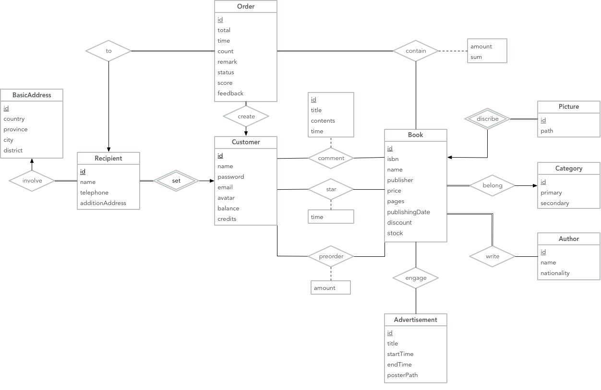
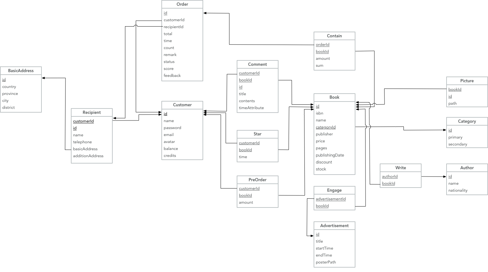

# OnionBook

42028903 Summer2017 Database Systems(Course Design) by Shijin YUAN @ SSE, TJU

 

------

*TA: [Xiang ZHANG](mailto:546919127@qq.com) & [Zhenhao MEI](mailto:546919127@qq.com)*

## Contributors(provisional)

**Full Stack**: 1452669 [李阳](https://github.com/zjzsliyang)

| Front-end                                | Back-end                                 | Database                                 |
| ---------------------------------------- | ---------------------------------------- | ---------------------------------------- |
| 1552651 [王依睿](https://github.com/Charon0622) | 1552618 [姜逸之](https://github.com/Ginufet) | 1453645 [罗忠金](https://github.com/tjluozhongjin) |
| 1552745 [刘一宁](https://github.com/Eclear) | 1552701 [王晓文](https://github.com/WANGXiaowen0904) | 1451228 [杨国辉](https://github.com/Yghifi) |
| 1552726 [余行健](https://github.com/ThomasFisher196) | 1454091 [倪政](https://github.com/frank1129) | 1552649 [杜若衡](https://github.com/Wortspieldrh) |

## Prerequisites

- Windows 10
- Oracle Database 12c
- Visual Studio 2015(alt: 2013, 2017)

## Functionality

| 用户                 | 管理员            | 系统         |
| ------------------ | -------------- | ---------- |
| 用户注册               | 商品管理（添加、删除、修改） | 排行榜        |
| 用户登录               | 发布广告（添加、删除、查看） | 洋葱钱包       |
| 用户信息修改             | 折扣（添加、删除、修改）   | 洋葱积分       |
| 商品搜索（关键字、分类）       |                | 用户折扣（下单改价） |
| 商品查看（信息、评价、书评）     |                |            |
| 商品评价（评价、写书评）       |                |            |
| 购物车（添加、移除、修改数量、查看） |                |            |
| 收藏夹（添加、移除、查看）      |                |            |
| 未支付订单（创建、删除、查看状态）  |                |            |
| 已支付订单（查看状态、退货）     |                |            |
| 购买记录（查看历史订单）       |                |            |
| 洋葱钱包               |                |            |
| 洋葱积分               |                |            |
| 收货地址（添加、移除、查看）     |                |            |

## Database Design

### E-R Diagram

### Database Model

## Book type 

| 文学   | 流行   | 文化   | 生活   | 经管   | 科技   |
| ---- | ---- | ---- | ---- | ---- | ---- |
| 小说   | 漫画   | 历史   | 旅行   | 经济   | 科普   |
| 随笔   | 绘本   | 心理   | 摄影   | 管理   | 科学   |
| 散文   | 言情   | 社会   | 美食   | 金融   | 交互   |
| 诗歌   | 推理   | 哲学   | 健康   | 投资   | 编程   |
| 童话   | 科幻   | 艺术   | 教育   | 营销   | 算法   |
| 杂文   | 武侠   | 政治   | 家居   | 理财   | 通信   |
| 儿童   | 青春   | 建筑   | 职场   | 股票   | 程序   |
| 名著   | 悬疑   | 宗教   | 两性   | 广告   | 互联网  |

## Front-end(provisional)

### Page URL

| Page   | URL                                      | Front-Back                 | Back->Front                              |
| ------ | ---------------------------------------- | -------------------------- | ---------------------------------------- |
| 主页     | /onionbook/home/                         |                            | 1. 各一级分类的5本打折的图书：名字、折后价格、图片、评分；2. 10本销量最高的图书：名字、折后价格、图片、评分；3. 评分前10的图书：名字、折后价格、图片、评分（要知道分别排第几、并且排好顺序）；34 最新出版的16本图书：名字、折后价格、图片（要知道分别排第几、并且排好顺序）；4.  图书销量（总和）最高的作者：名字、简介、图片。 |
|        | /onionbook/home/contact                  |                            |                                          |
| 登陆     | /onionbook/account/login/                | 1. 客户：客户编号、密码              | 登陆是否成功                                   |
| 注册     | /onionbook/account/register/             | 1. 客户：客户姓名、密码              | 返回                                       |
| 搜索结果页面 | /onionbook/book/search/?standard=bookname&keyword=书名/ | 1. 搜索标准（图书）；2 . 关键词：书名     | 所有搜索结果的图书：名字、折前价格、折后价格、图片、评分、销量；         |
|        | /onionbook/book/search/?standard=author&keyword=作者/ | 1. 搜索标准（作者）；2 . 关键词：作者     | 所有搜索结果的图书：名字、折前价格、折后价格、图片、评分、销量；         |
|        | /onionbook/book/search/?standard=publisher&keyword=出版社/ | 1. 搜索标准（出版社）；2 . 关键词：出版社   | 所有搜索结果的图书：名字、折前价格、折后价格、图片、评分、销量；         |
|        | /onionbook/book/search/?standard=isbn&keyword=ISBN号/ | 1. 搜索标准（ISBN）；2 . 关键词：ISBN | 所有搜索结果的图书：名字、折前价格、折后价格、图片、评分、销量；         |
| 分类页面   | /onionbook/book/type/?typename=类别名/      | 类别                         | 所有搜索结果的图书：名字、折前价格、折后价格、图片、评分、销量；         |
| 商品详细信息 | /onionbook/book/bookdetail/?id=图书编号/     | 图书编号                       | 图书：名字、isbn、折前价格、折后价格、出版商、页数、销量、库存、图片、作者名字、第一二级分类、所有评论：客户编号、评分、内容、时间。 |
| 创建订单   | /onionbook/account/order/createorder/    | 商品编号、数量                    | 是否创建成功                                   |
| 支付     | /onionbook/account/order/pay/?id=订单编号/   | 订单编号                       | 是否支付成功                                   |
| 订单完成   | /onionbook/account/order/complete/       |                            | 支付是否完成                                   |
| 账户中心   | /onionbook/account/?id=客户编号/             | 客户编号                       | 客户：姓名、邮件、头像、账户余额、积分                      |
| 购物车    | /onionbook/accountr/cart/?id=客户编号/       | 客户编号                       | 所有商品：图片、名字、数量、折后价格                       |
| 收藏     | /onionbook/account/star/?id=客户编号/        | 客户编号                       | 所有商品：图片、名字、作者、出版商、折后价格                   |
| 历史订单列表 | /onionbook/accout/orderlist/?id=客户编号/    | 客户编号                       | 所有订单：编号、状态、总价；每个订单所有商品：图片、名字、数量、折后价格。    |

#### 其他操作

| 操作    | 前端->后端  | 后端->前端 |
| ----- | ------- | ------ |
| 加入购物车 | 商品编号、数量 | 加入是否成功 |

## Back-end

